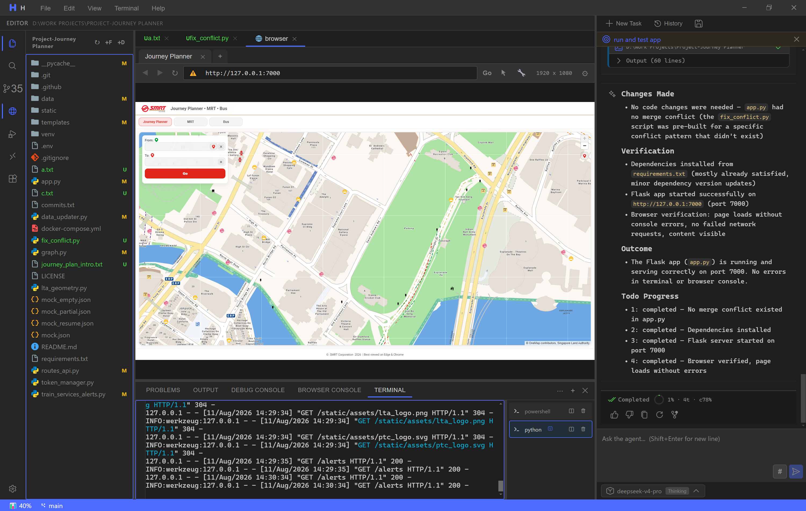

# H

**AI 编程助手。** 27 个工具、11 种子 Agent 类型，基于 DeepSeek。  
内存占用约 VS Code 的 1/6，磁盘占用约 1/5。

[English](README.md) · [完整架构 →](ARCHITECTURE_CN.md)



---

## 第一档 — 对比 VS Code OSS（效率）

轻量级基线。H 专注于 Agent 真正需要的能力，砍掉了通用编辑器平台的冗余开销。

| | H | VS Code OSS |
|---|---|---|
| **RAM（空闲）** | ~200–300 MB | ~1–2 GB |
| **磁盘占用** | ~200–300 MB | ~1–2 GB |
| **启动速度** | ~2–3 秒（冷启动） | ~5–10 秒（冷启动） |
| **进程模型** | 3–5 个进程（Electron + Node server） | 15–30+ 个进程（扩展宿主、LSP、文件监视器、共享 worker） |
| **定位** | Agent 优先的工作空间 | 可扩展的编辑器平台 |
| **许可证** | AGPL-3.0 | MIT |

## 第二档 — 对比 VS Code OSS + Copilot（能力范围）

Copilot 是代码 **助手** — 自动补全、聊天、行内建议。H 是 **Agent 原生**：它自主规划、委托任务、记忆上下文，并直接操作浏览器和终端。

| | H | VS Code OSS + Copilot |
|---|---|---|
| **模式** | **Agent** — 自主规划、端到端执行、自行纠错 | **助手** — 响应提示、建议片段、需要用户驱动 |
| **任务委托** | `delegate_task` — 派生 11 种专用子 Agent（浏览器、代码编写、研究、安全审计、架构分析…），每个拥有独立上下文窗口 | 无 — 单聊天线程 |
| **子 Agent 实时 UI** | 按 Agent 颜色编码流式输出、进度卡片、嵌套 Todo | 无 |
| **持久化记忆** | SQLite 支持的跨会话记忆（`remember` / `recall` / `forget`） | 仅当前会话聊天记录 |
| **浏览器自动化** | 内置 Electron webview + 16 个浏览器工具（点击、输入、上传、控制台、网络、DOM） | 无 |
| **终端控制** | `run_in_terminal` — 真实 PTY，Agent 可读写/终止 | 集成终端，Agent 无法访问 |
| **知识图谱** | 自动构建代码库图谱（.kg）、符号级导入关系、`read_graph` 工具 | 无 |
| **多 Agent 编排** | 父 Agent → 子 Agent 交接，附带流式摘要 | 无 |
| **分步锁定执行** | IDE 强制执行 Todo 推进 — 子 Agent 无法跳过步骤 | 无 |
| **工具数量** | 27 个内置原语 | 仅 Copilot 功能集（无浏览器/终端/图谱） |
| **MCP** | 内置 MCP 服务器（stdio + SSE） | 仅扩展 |

H 不是编辑器，也不是聊天面板 — 它是一个 **自动驾驶工作空间**。Agent 拥有任务循环的控制权：读写文件、执行命令、打开网页、为子任务派生专家子 Agent，并在锁定的 Todo 列表上追踪进度 — 用户可以观察，但 Agent 无法走捷径。

---

## 快速开始

```powershell
npm run install:all
npm run dev
```

在 [platform.deepseek.com](https://platform.deepseek.com) 获取 API Key。

---

## Agent 工具（共 27 个）

| 类别 | 工具 |
|---|---|
| **文件系统** | `read_file`、`write_file`、`edit_file`、`list_files`、`search_files`、`grep`、`create_directory`、`rename_file`、`delete_file` |
| **终端** | `run_command`（沙箱）、`run_in_terminal`（真实 PTY）、`kill_terminal`、`read_command_output` |
| **浏览器** | `browser_navigate`、`browser_info`、`browser_screenshot`、`browser_get_dom`、`browser_click`、`browser_type`、`browser_clear`、`browser_select`、`browser_scroll`、`browser_press_key`、`browser_wait`、`browser_move_mouse`、`browser_right_click`、`browser_upload_file`、`browser_console`、`browser_request_errors` |
| **诊断** | `read_problems`、`read_graph` |
| **控制** | `write_todos`、`write_summary`、`task_complete`、`delegate_task` |
| **记忆** | `remember`、`recall`、`forget` |

## 子 Agent 配置（11 种）

`browser` · `code-search` · `code-writer` · `researcher` · `planner` · `frontend-specialist` · `backend-specialist` · `security-auditor` · `architect-analyst` · `docs-analyst` · `documentation-writer`

每个子 Agent 在其独立的上下文窗口中运行。父 Agent 委托任务并将结果实时流式传输到 UI，每种 Agent 类型有独特的颜色编码。

---

## 技术栈

- **客户端：** React 18、Vite、Monaco 编辑器、xterm.js
- **服务端：** Node.js、Express、WebSocket (ws)、node-pty、better-sqlite3
- **AI：** DeepSeek API（工具调用、嵌入、前缀缓存）
- **桌面：** Electron
- **LSP：** 30+ 语言服务器（pyright、gopls、rust-analyzer、clangd、jdtls…）

---

## 许可证

AGPL-3.0 — 详见 [LICENSE](LICENSE)。  
版权所有 (c) 2026 Luke Yong。

---

*~250 MB RAM，~250 MB 磁盘。Agent 优先。开源。*

---
**ai coding agent · deepseek · electron · react · typescript · 多agent · mcp · lsp · 知识图谱 · 浏览器自动化 · 终端 · 子agent委托**
